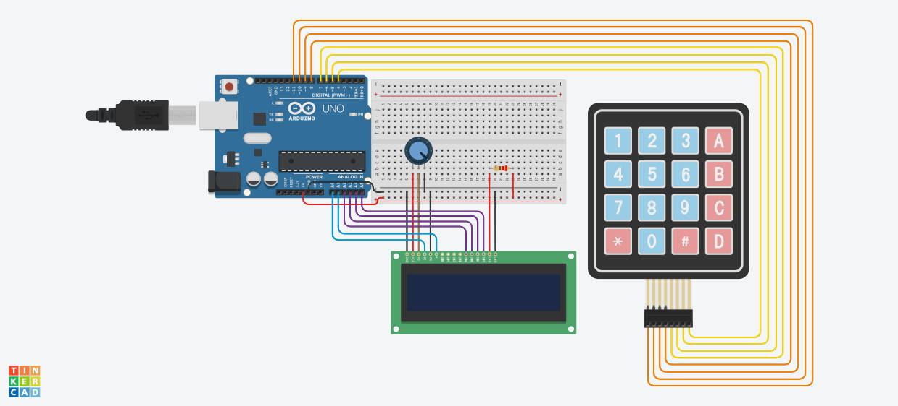

# Trabalho de Estrutura de Dados

O objetivo deste trabalho é em criar um algoritmo que converta um número decimal digitado pelo usuário para a base 2 (binária) e para a base 8 (octal).

Além disso, teve que ser implementada no algoritmo o tipo abstrado de dados (TAD) PILHA com o uso de alocação dinâmica de memória.

Foi necessário criar duas versões do código:
- [conversor.c](conversor.c) -> Versão cmd
- [conversor-arduino.c](conversor-arduino.c) -> Versão arduino

Essa sepração foi necessária porque a segunda parte do trabalho consistia em simular essa conversão usando o arduino, para isto, foi exigido o uso do tinkercad.

Para simular o algoritmo no tinkercad, foi utilizado o keypad 4x4 para digitar o valor em decimal e o LCD 16x2 para mostrar os resultados da conversão. O projeto final encontra-se neste [link](https://www.tinkercad.com/things/5facz15TwC9) com todo o circuito montado e o código. Segue abaixo uma imagem do circuito:

Obs: Devida a um overflow de memória no arduino, foi necessário limitar (no código do [conversor-arduino.c](conversor-arduino.c)) o valor em decimal para no máximo 32767. 
